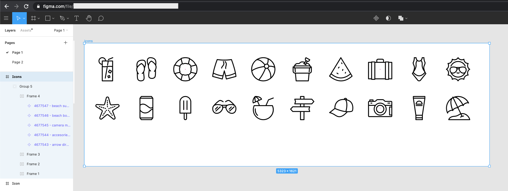

# Export SVGs from Figma via CLI

## Getting Started

Export your SVGs that are in your Figma project easily via CLI or node.js.


## Pre-requisties

- You will need a DEV_TOKEN (See Step 5 of Setup)
- Your Icons are in a single Frame
- Each icon is a Figma Component (Select Icon and use the shortcut key ⌥⌘K)
  

### Output

Your SVGs will be generated in `src/svg` folder

### Setup

1. `yarn install`
2. Select the frame your icons are in 
3. Copy the URL in the browser; it should look similar to `https://www.figma.com/file/abcASewbASmnas/Test?node-id=1%3123`
4. Run `node src/setupEnv.js` and paste in your URL copied from step 3 when prompted. This will generate a `.env` file
5. Generate a DEV_TOKEN a.k.a Personal Access Token by going to Help and Account > Account Settings > Personal Access Token
6. Add your DEV_TOKEN from step 5 into `.env` file
7. Run `node src/index.js` and your SVGs will be generated into `src/svg` folder

### Usage with node.js

```js
const { svgExporter } = require('@wfp/figma-connect');

svgExporter();
```

### Filtering Private Components (starting with a . or a \_)

1. If you want to ignore / filter private components that start with a . or \_, change the FILTER_PRIVATE_COMPONENTS variable to `true`. Thanks to [lennertVanSever for their contribution to this](https://github.com/jacobtyq/figma-connect/pull/27)

### Limitations

Figma API has a fixed number of requests (rate limits) you can call per minute. This script will process a 20 requests per 45 seconds to avoid hitting that limit.
